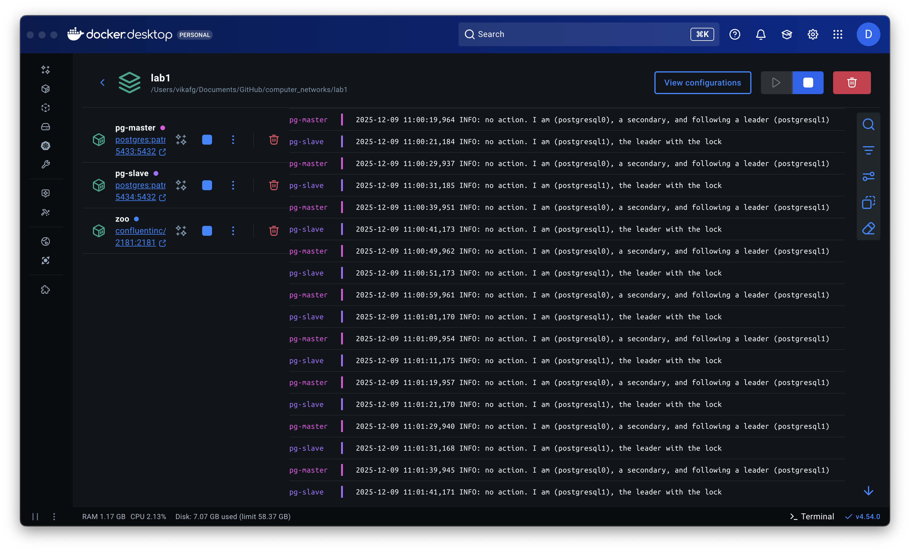
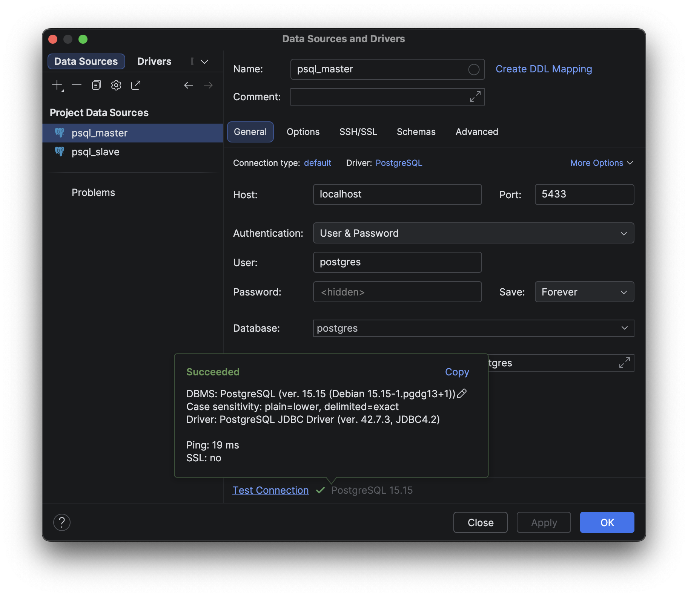
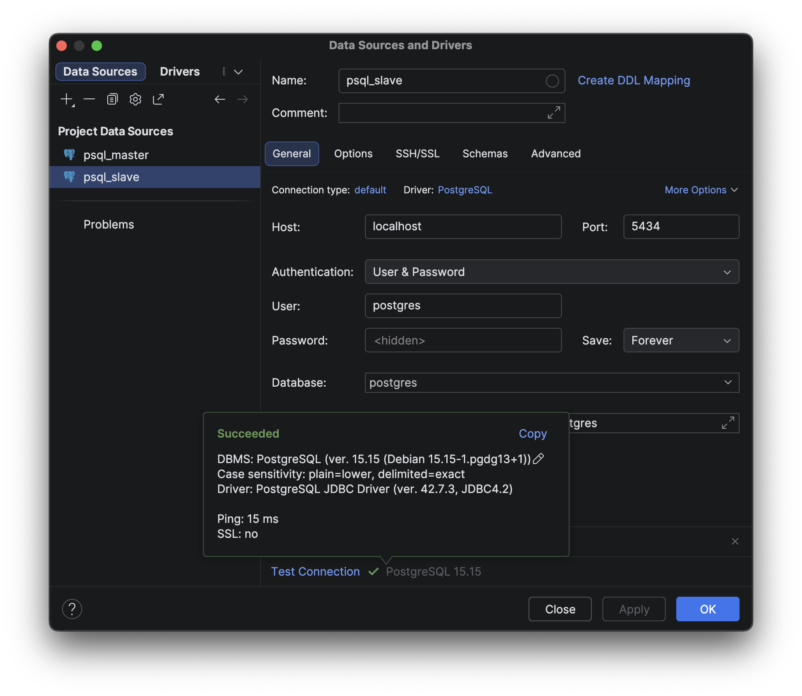
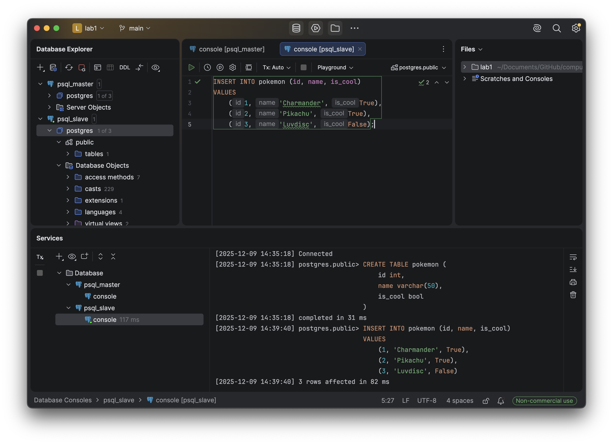
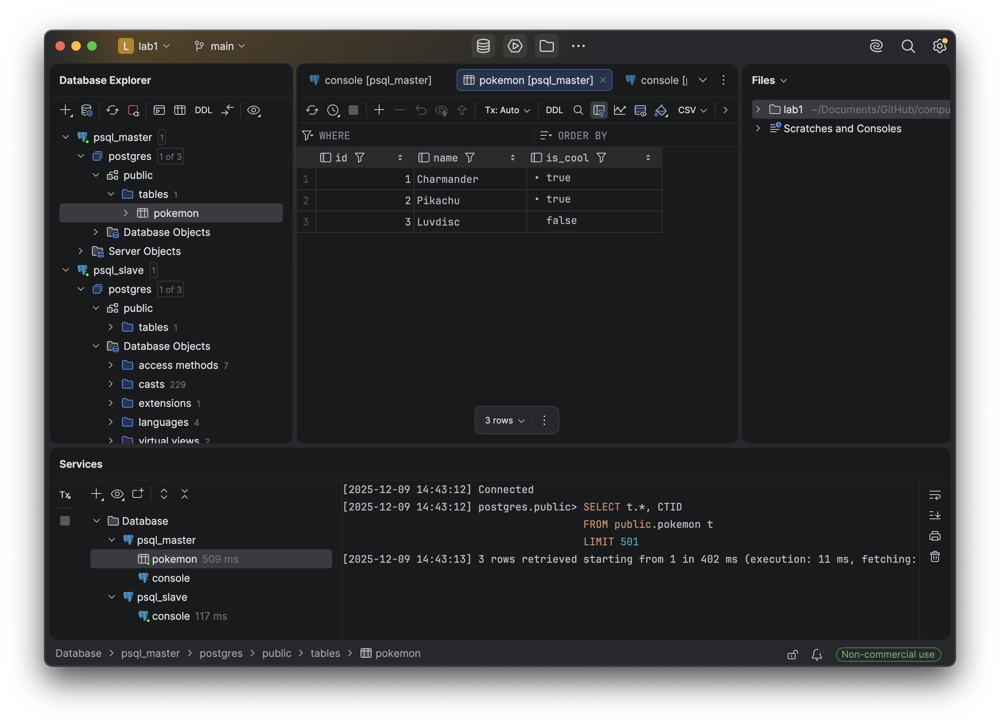
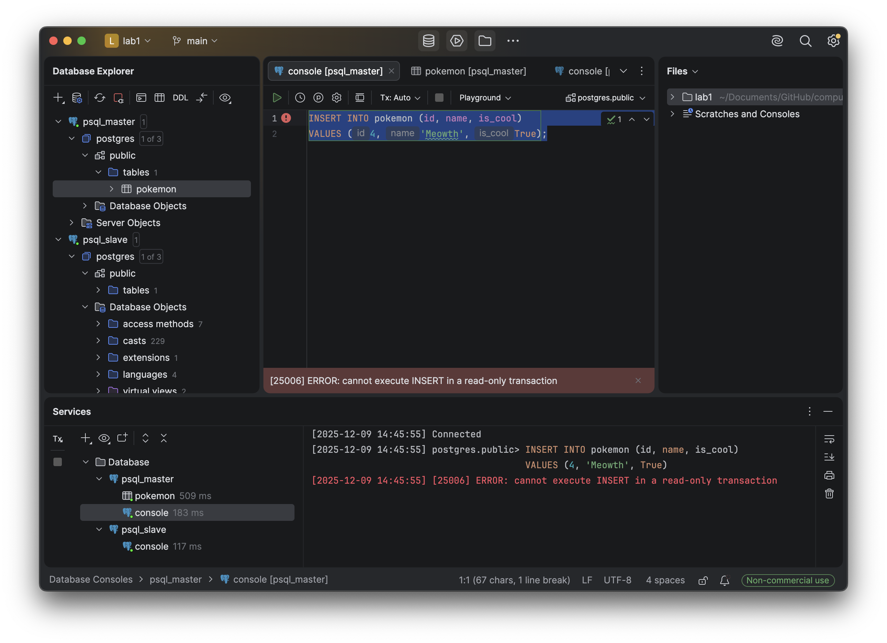
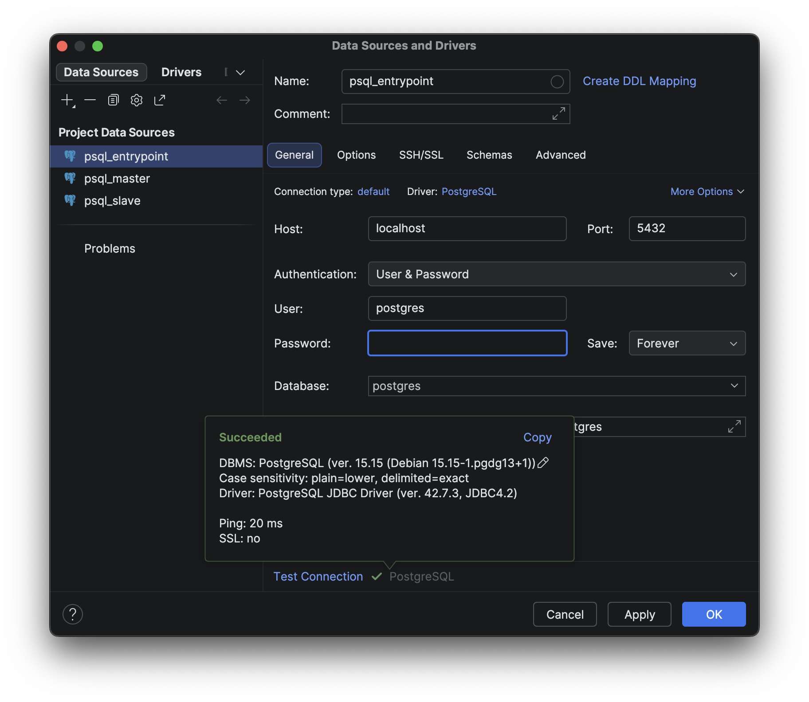
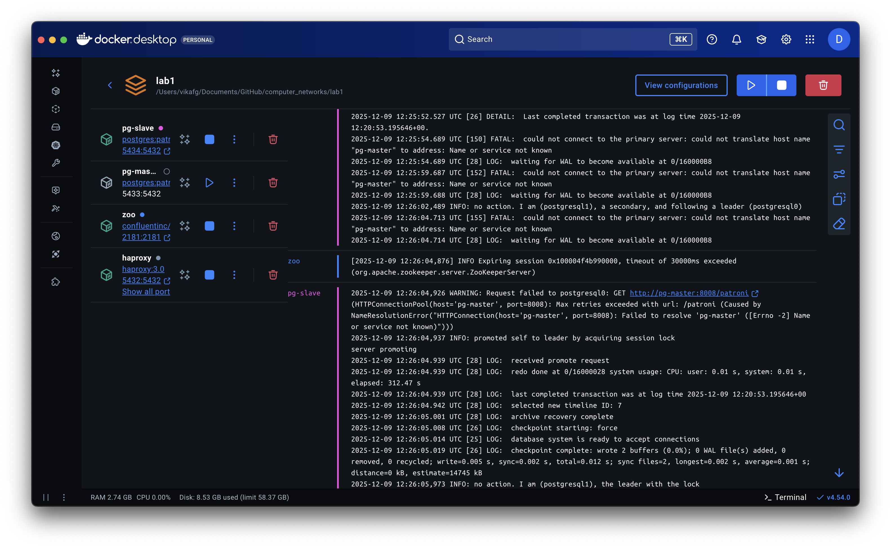
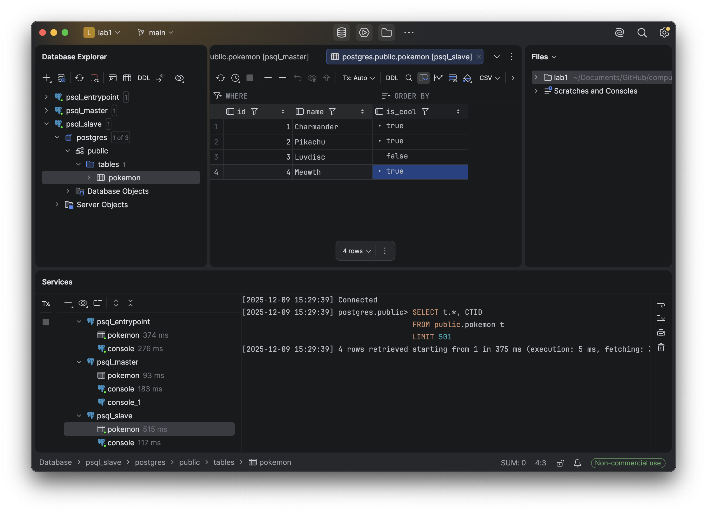
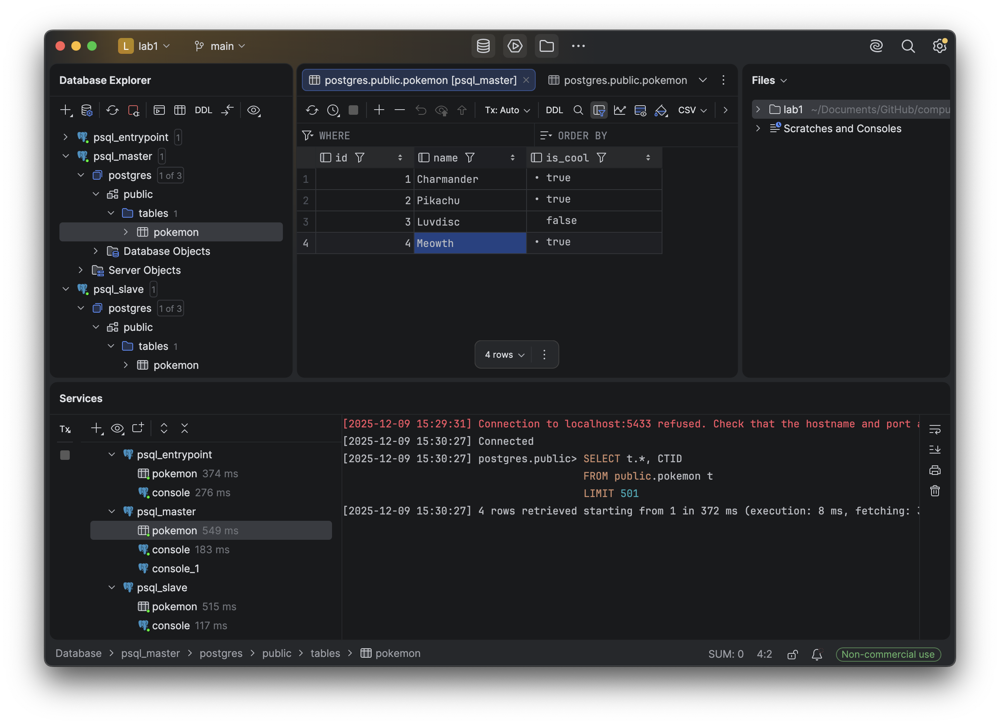

# ЛР 1. HA Postgres Cluster

**Задача:** Развернуть и настроить высокодоступный кластер Postgres

Кластеризация сделана при помощи Patroni, Zookeeper для управления репликацией и определения "лидера" кластера, HAProxy для балансировки и высокой доступности

**Улучшение лабы:** Настроили кластер так, чтобы после “возвращения” второй ноды в кластер она автоматически получала данные, которые
были записаны в её отсутствие

## Часть 1. Поднимаем Postgres

Подготавливаем Dockerfile для pg. Кластеризацию будем делать с помощью Patroni, который требует доступ к бинарникам Postgres. Для этого создаём образ, включающий Postgres и Patroni. Здесь же сразу поправили локаль и добавили архивирование WAL для восстановления и синхронизации реплик в кластере Patroni (требуется для улучшения лабы).

```Dockerfile
FROM postgres:15

# фикс локали
RUN echo "en_US.UTF-8 UTF-8" > /etc/locale.gen && \
    locale-gen en_US.UTF-8

ENV LANG=en_US.UTF-8
ENV LANGUAGE=en_US:en
ENV LC_ALL=en_US.UTF-8

RUN apt-get update -y && \
    apt-get install -y netcat-openbsd python3-pip curl python3-psycopg2 python3-venv iputils-ping

RUN python3 -m venv /opt/patroni-venv && \
    /opt/patroni-venv/bin/pip install --upgrade pip && \
    /opt/patroni-venv/bin/pip install patroni[zookeeper] psycopg2-binary

# архивирование WAL для восстановления и синхронизации реплик в кластере Patroni
RUN mkdir -p /var/lib/postgresql/wal_archive && \
    chown -R postgres:postgres /var/lib/postgresql/wal_archive && \
    chmod 700 /var/lib/postgresql/wal_archive

COPY postgres0.yml /postgres0.yml
COPY postgres1.yml /postgres1.yml

ENV PATH="/opt/patroni-venv/bin:$PATH"

USER postgres
```

Создаем docker-compose, описывающий развертывание Postgres с использованием Zookeeper для управления репликацией. Для `pg-master` и `pg-slave` добавлен архив WAL в `volumes`. Архив WAL нужен для того, чтобы репликационные ноды могли догонять состояние мастера после временного отключения или перезапуска.

```yml
services:
  pg-master:
    build: .
    image: localhost/postgres:patroni
    container_name: pg-master
    restart: always
    hostname: pg-master
    environment:
      POSTGRES_USER: postgres
      POSTGRES_PASSWORD: postgres
      PGDATA: '/var/lib/postgresql/data/pgdata'
    expose:
      - 8008
    ports:
      - 5433:5432
    volumes:
      - pg-master:/var/lib/postgresql/data
      - pg-wal-archive:/var/lib/postgresql/wal_archive # Архив WAL для синхронизации
    command: patroni /postgres0.yml

  pg-slave:
    build: .
    image: localhost/postgres:patroni
    container_name: pg-slave
    restart: always
    hostname: pg-slave
    expose:
      - 8008
    ports:
      - 5434:5432
    volumes:
      - pg-slave:/var/lib/postgresql/data
      - pg-wal-archive:/var/lib/postgresql/wal_archive # Архив WAL для синхронизации
    environment:
      POSTGRES_USER: postgres
      POSTGRES_PASSWORD: postgres
      PGDATA: '/var/lib/postgresql/data/pgdata'
    command: patroni /postgres1.yml

  zoo:
    image: confluentinc/cp-zookeeper:7.7.1
    container_name: zoo
    restart: always
    hostname: zoo
    ports:
      - 2181:2181
    environment:
      ZOOKEEPER_CLIENT_PORT: 2181
      ZOOKEEPER_TICK_TIME: 2000

volumes:
  pg-master:
  pg-slave:
  pg-wal-archive:
```

Далее создаём конфигурацию Patroni (`postgres0.yml`, `postgres1.yml`). `postgres1.yml` идентичен `postgres0.yml`, за исключением того, что `name: postgresql1`, `data_dir` изменён на `/var/lib/postgresql/data/postgresql0` и везде `pg-master` изменён на `pg-slave`.

```yml
scope: my_cluster
name: postgresql0

restapi:
  listen: pg-master:8008
  connect_address: pg-master:8008

zookeeper:
  hosts:
    - zoo:2181

bootstrap:
  dcs:
    ttl: 30
    loop_wait: 10
    retry_timeout: 10
    maximum_lag_on_failover: 10485760
    synchronous_mode: true
    postgresql:
      use_pg_rewind: true
      use_slots: true
      parameters:
        wal_level: replica
        hot_standby: "on"
        wal_keep_segments: 32
        max_wal_senders: 10
        max_replication_slots: 10
        archive_mode: "on"
        archive_command: 'test ! -f /var/lib/postgresql/wal_archive/%f && cp %p /var/lib/postgresql/wal_archive/%f'
        archive_timeout: 60
  pg_hba:
  - host replication replicator 0.0.0.0/0 md5
  - host all all 0.0.0.0/0 md5

postgresql:
  listen: 0.0.0.0:5432
  connect_address: pg-master:5432
  data_dir: /var/lib/postgresql/data/postgresql0
  bin_dir: /usr/lib/postgresql/15/bin
  pgpass: /tmp/pgpass0
  remove_data_directory_on_rewind_failure: true
  authentication:
    replication:
      username: replicator
      password: rep-pass
    superuser:
      username: postgres
      password: postgres
  parameters:
    unix_socket_directories: '.'
    wal_keep_segments: 64
    max_wal_size: 1GB

recovery_conf:
  restore_command: 'cp /var/lib/postgresql/wal_archive/%f %p'

watchdog:
  mode: off

tags:
  nofailover: false
  noloadbalance: false
  clonefrom: false
  nosync: false
```

Деплоим. В логах видим, что нода `pg-slave` стала лидером.

```
docker compose up --build -d
```



Zookeeper тоже работает.


## Часть 2. Проверяем репликацию

Подключаемся к нодам при помощи DataGrip.

Для `pg-master` - `localhost:5433`



Для `pg-slave` - `localhost:5434`



Создаём таблицу и записываем данные на мастер ноде `pg-slave`

```sql
CREATE TABLE pokemon (
    id int,
    name varchar(50),
    is_cool bool
);

INSERT INTO pokemon (id, name, is_cool)
VALUES
    (1, 'Charmander', True),
    (2, 'Pikachu', True),
    (3, 'Luvdisc', False);
```



Обновляем БД и видим, что на слейв ноде `pg-master` тоже появилась такая же таблица с такими же значениями



Синхронизация произошла, данные одинаковые, всё круто

Попробуем вставить данные в слейв таблицу и видим, что она read-only, то, что нам и надо



## Часть 3. Делаем высокую доступность

Добавляем HAProxy в `docker-compose`:

```yml
haproxy:
  image: haproxy:3.0
  container_name: postgres_entrypoint
  ports:
    - 5432:5432
    - 7007:7007
  depends_on:
    - pg-master
    - pg-slave
    - zoo
  volumes:
    - ./haproxy.cfg:/usr/local/etc/haproxy/haproxy.cfg
```

Создаем `haproxy.cfg`

```cfg
global
    maxconn 100

defaults
    log global
    mode tcp
    retries 3
    timeout client 30m
    timeout connect 4s
    timeout server 30m
    timeout check 5s

listen stats
    mode http
    bind *:7007
    stats enable
    stats uri /
    stats refresh 10s
    stats show-legends
    stats admin if TRUE

listen postgres
    bind *:5432
    option httpchk GET /patroni
    http-check expect status 200
    default-server inter 3s fall 3 rise 2 on-marked-down shutdown-sessions
    server postgresql_pg_master_5432 pg-master:5432 maxconn 100 check port 8008
    server postgresql_pg_slave_5432 pg-slave:5432 maxconn 100 check port 8008
```

Перезапускаем проект и проверяем работу HAProxy

```
docker compose stop
docker compose up --build -d
```

Обе ноды корректно поднялись и распределили между собой роли

```
pg-master
2025-12-09 12:21:03,064 INFO: no action. I am (postgresql0), the leader with the lock

pg-slave
2025-12-09 12:21:02,501 INFO: no action. I am (postgresql1), a secondary, and following a leader (postgresql0)
```

Zookeeper поднялся и ноды подключились к нему

```
pg-master
2025-12-09 12:20:51,620 INFO: Connecting to zoo(172.18.0.2):2181, use_ssl: False
2025-12-09 12:20:51,632 INFO: Zookeeper connection established, state: CONNECTED

pg-slave
2025-12-09 12:20:52,144 INFO: Connecting to zoo(172.18.0.2):2181, use_ssl: False
2025-12-09 12:20:52,147 INFO: Zookeeper connection established, state: CONNECTED
```

HAProxy поднялась без ошибок

```
[WARNING]  (8) : Server postgres/postgresql_pg_slave_5432 is UP, reason: Layer7 check passed, code: 200, check duration: 15ms. 1 active and 0 backup servers online. 0 sessions requeued, 0 total in queue.
[WARNING]  (8) : Server postgres/postgresql_pg_master_5432 is UP, reason: Layer7 check passed, code: 200, check duration: 6ms. 2 active and 0 backup servers online. 0 sessions requeued, 0 total in queue.
```

Подключаемся к новой БД через HAProxy



Отключаем мастер ноду и проверяем логи (уже бывшей) слейв ноды. Видим, что через время `pg-slave` стала мастер нодой



Идём в DataGrip и записываем новые данные в нашу табличку (уже ранее записанные данные автоматически подтянулись)


После этого пойдём посмотрим записалась ли новая строка в таблицу `psql_slave`



Всё ок, она там появилась.

Посмотреть данные в `psql_master` невозможно, потому что не подключиться к контейнеру (мы же его отключили). Поэтому снова поднимем `pg-master` и посмотрим подтянется ли автоматически новая запись



Да, всё круто, мы выполнили все поставленные задачи и улучшения
