# ЛР 2. Loki + Zabbix + Grafana

**Задача:** Подключить к тестовому сервису Nextcloud мониторинг + логирование. Осуществить визуализацию через Grafana

## Часть 1. Логирование

Собираем [docker-compose.yml](docker-compose.yml) и [promtail_config.yml](promtail_config.yml) файлы как написано в лабораторной работе

Запускаем и проверяем всё ли стартануло через команды:

```
docker compose up --build -d
docker ps
ls -la
```

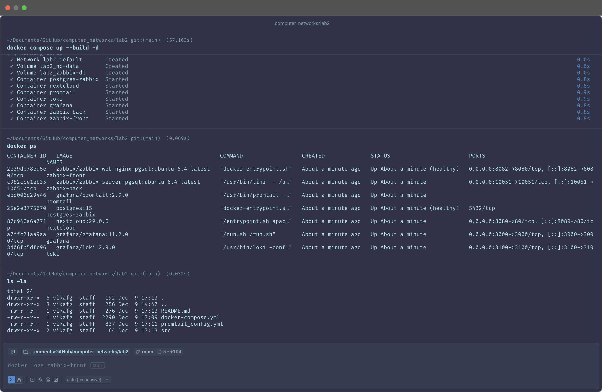

Далее инициализирует Nextcloud. В браузере переходим по указаному порту (в моём случае это `localhost:8080`) и создаём учётку

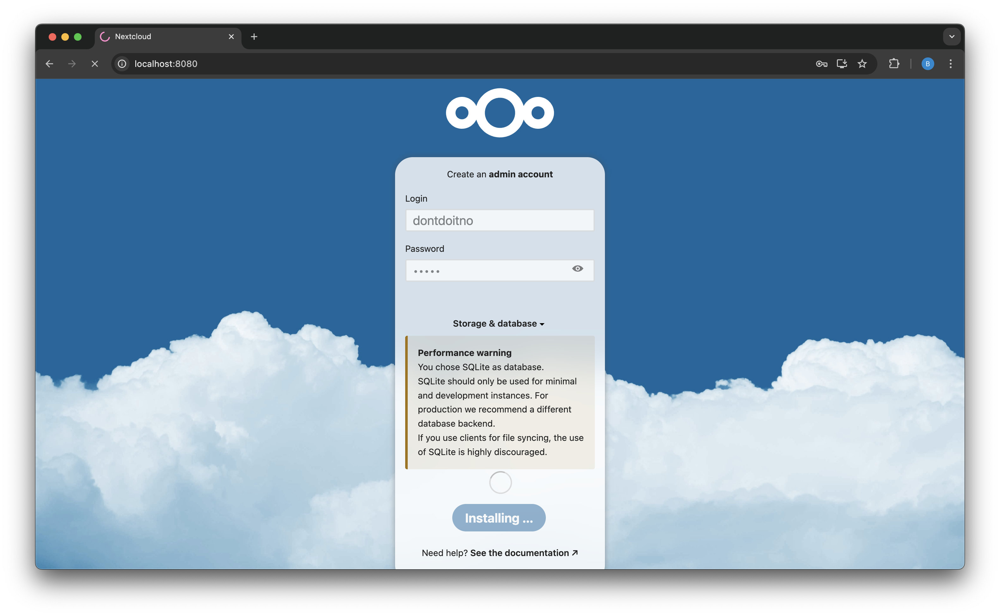

Идём смотреть, чтобы писались логи в файл

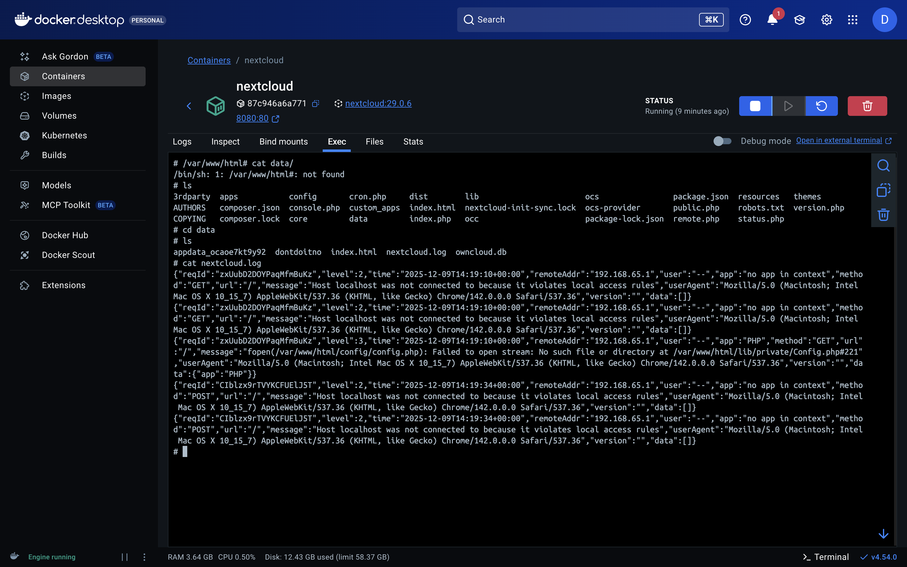

Всё хорошо.

В логах Promtail проверяем, что там указан нужный нам log-файл: должны быть строчки, содержащие `msg=Seeked /opt/nc_data/nextcloud.log`. На скрине это видно, так что всё круто

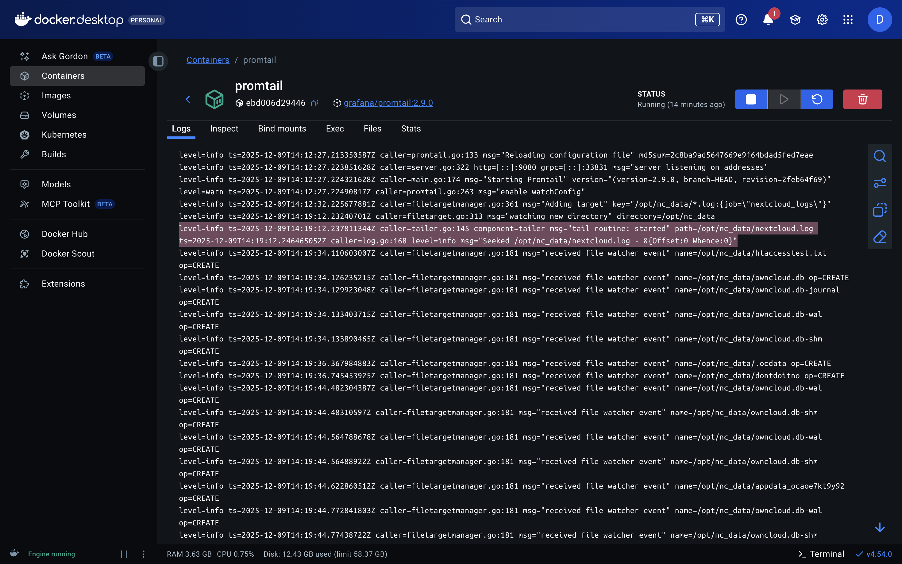

## Часть 2. Мониторинг

Мониторинг реализован при помози Zabbix. Сначала переходим по `localhost:8082`, авторизуемся, в `Data Collections --> Template` загружаем наш [template.yml](template.yml)

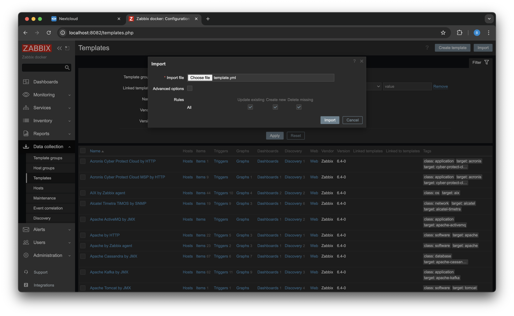

Для установки общения между Nextcloud и Zabbix выполним команду `php occ config:system:set trusted_domains 1 --value="nextcloud"` в консоли контейнера Nextcloud, предварительно залогинвшись под логином `www-data`

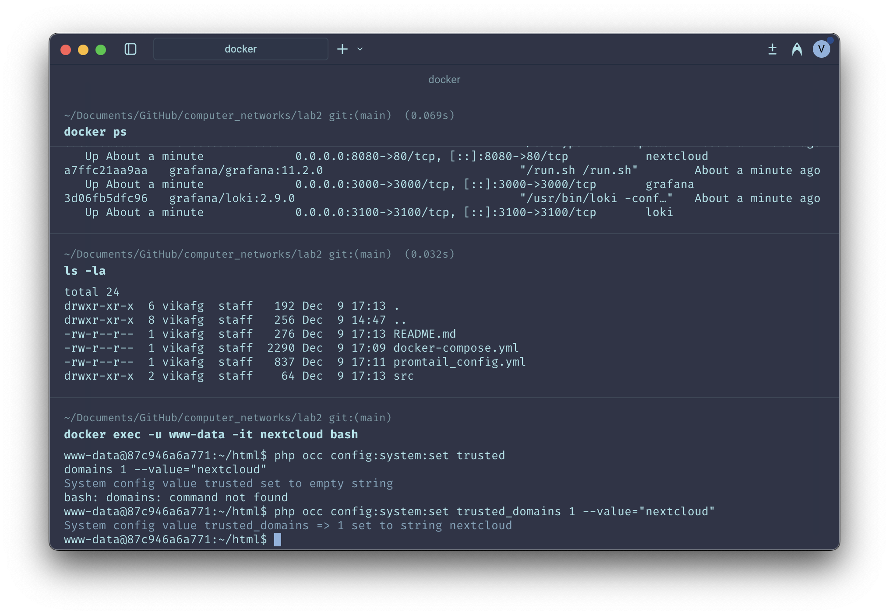

Далее добавляем нового хоста (Nextcloud) в Zabbix, в дальнейшем мы будем его мониторить

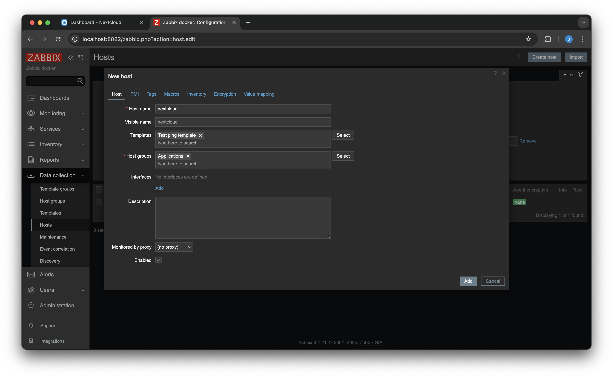

Проверим мониторится ли nextcloud

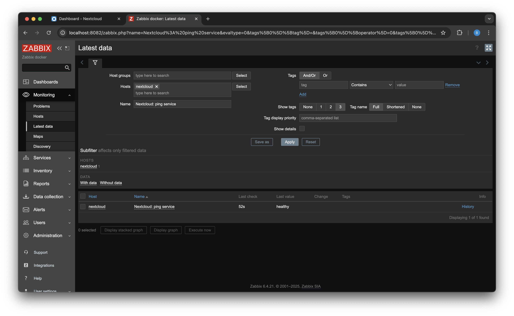

Всё хорошо, health check происходит

## Часть 3. Визуализация

Визуализацию делаем через Grafana, для этого надо её поднять и подключить Loki и Zabbix. Сначала выполним следующие команды:

```
docker exec -it grafana bash -c "grafana cli plugins install alexanderzobnin-zabbix-app"
docker restart grafana
```


Заходим в Grafana через `http://localhost:3000/`, в разделе Administration --> Plugins подключаем плагин Zabbix. Теперь надо подключить сервисы (Loki и Zabbix) к Grafana, это делаем в Connections --> Data sources

Подключаем Loki (URL: `http://loki:3100/`)

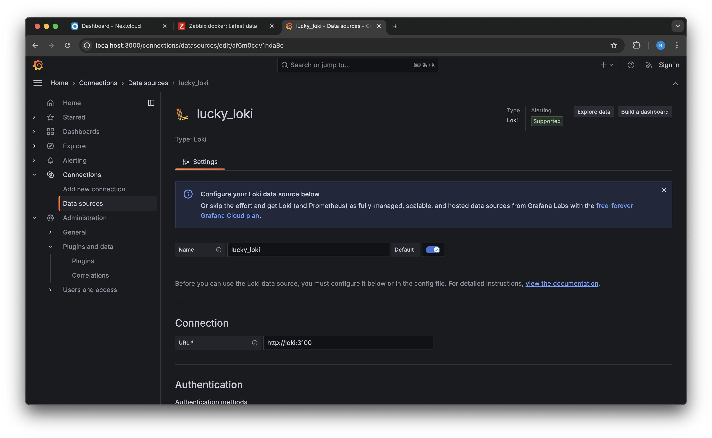

Сохраняем и тестим

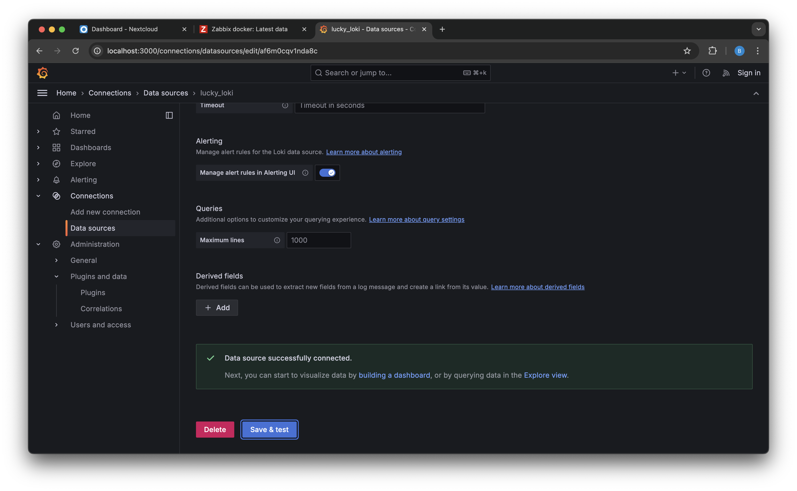

Всё круто, мы подключились.

Теперь тоже самое для Zabbix (URL: `http://zabbix-front:8080/api_jsonrpc.php`)

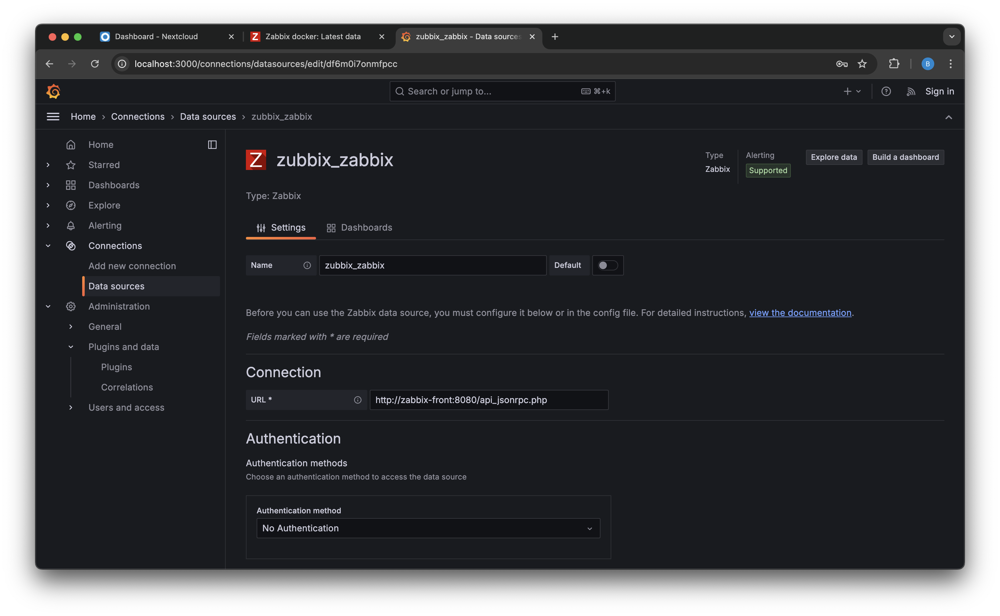

Сохраняем и тестим

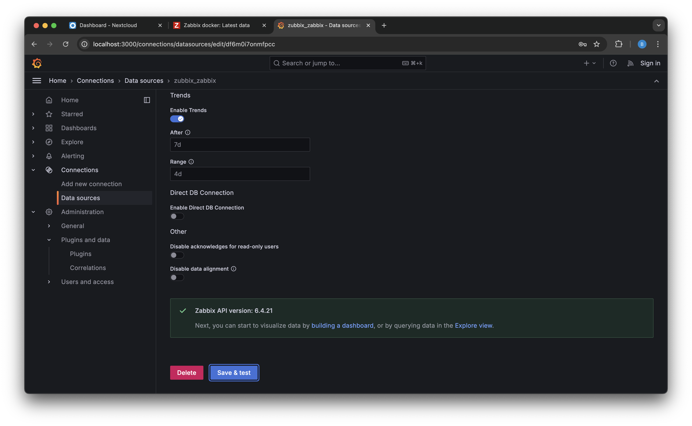

И снова всё круто, какое счастье!

Теперь пойдём посмотрим логи в Loki и Grafana. Сначала их, конечно, не было видно, потому что докер поднят был 7 часов назад, а отображались только недавние логи :)

Query и логи в Loki

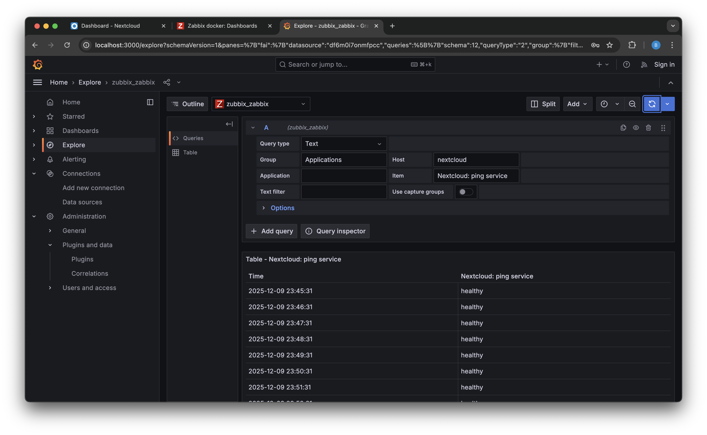

Query и логи в Zabbix

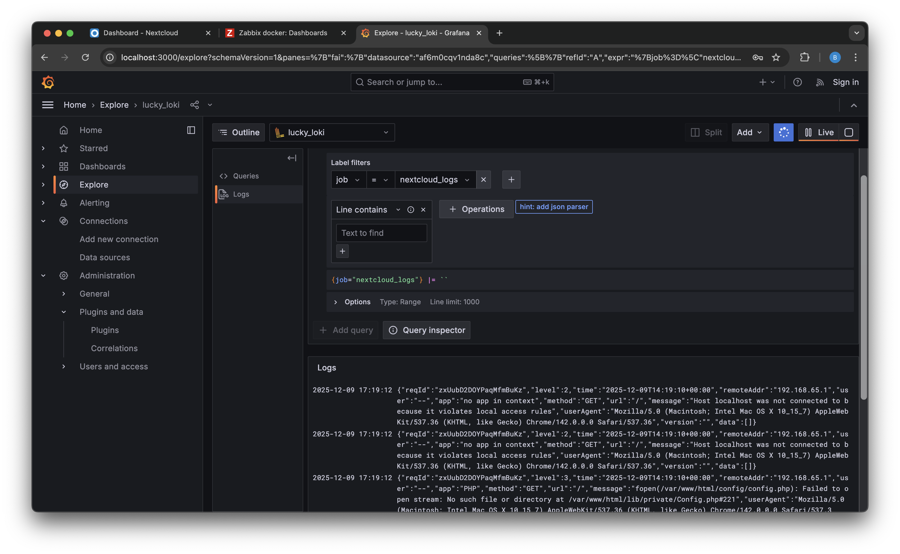

Всё супер, логи видно

Теперь сделаем дашборд для визуализации

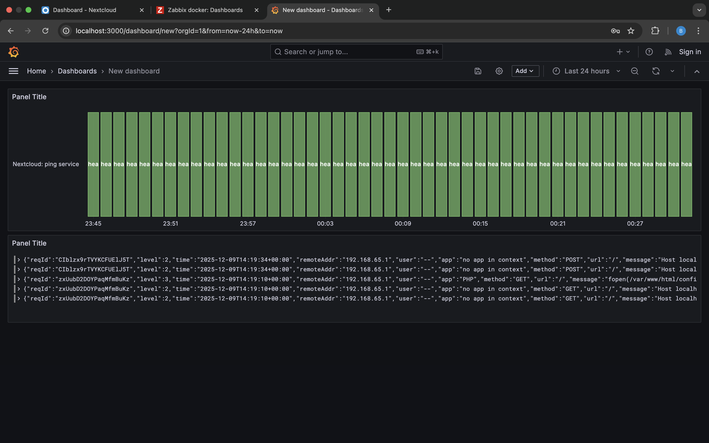

На этом лабораторная закончена, всем спасибо, было интересно и познавательно!

# Вопросы

1. *Чем SLO отличается от SLA?*

   SLO — внутренняя цель сервиса по доступности, то, к чему стремится команда SLA — формальное соглашение между поставщиком и клиентом, определяющее необходимый уровень доступности сервиса и включающий санкции за невыполнение указанных требований
2. *Чем отличается инкрементальный бэкап от дифференциального?*

   Инкрементальный бекап — история изменений с момента последнего бекапа любого рода Дифференциальный бекап — история изменений с момента последнего полного бекапа
   Например:
   `полный -> инкрементальный -> инкрементальный` — в такой ситуации последний бекап будет содержать изменения от первого инкрементального бекапа `полный -> дифференциальный -> дифференциальный` — в такой ситуации последний бекап будет содержать изменения от первого бекапа (полного)
3. *В чем разница между мониторингом и observability?*

   Мониторинг фокусируется на известных метриках и заранее настроенных оповещениях, полезен для контроля текущего состояния. Observability дает возможность анализировать поведение системы с использованием метрик, логов и трассировок, что помогает выявлять и устранять неизвестные проблемы. Вместе они дополняют друг друга: мониторинг указывает на проблему, а наблюдаемость помогает понять причину
